Markdown
# ⚡ MICHAEL W. LANNEN
### **Security Operations & Infrastructure Engineer** 📍 *Beckley, WV* | 📧 *[Michael.lannen93@gmail.com](mailto:Michael.lannen93@gmail.com)* 👉  

---

> ## 🚀 CORE ATTENTION VALUATION
> **Security Operations Professional with 2 years of dedicated Cybersecurity engineering and 6 years of high-velocity IT Enterprise Operations.** A versatile infrastructure engineer recognized for architecting, deploying, and pioneering organizational security programs from the ground up—transforming unmonitored environments into secure, compliant, and visible defense frameworks across Hybrid, Azure, and AWS cloud topologies.

---

## 🏆 PROFESSIONAL CERTIFICATIONS
⚡ `CompTIA CySA+` | `CompTIA Security+` | `CompTIA Network+` | `CompTIA ITF+` | `CompTIA CSAP`

---

## 🛠️ CORE TECHNICAL SKILLS MATRIX

| 🛡️ Security Operations (SecOps) | 🔑 Cloud & Identity (IAM) | 🌐 Networking & Infrastructure |
| :--- | :--- | :--- |
| • Greenfield SIEM Deployment • SentinelOne EDR Platform • Microsoft Sentinel SIEM • GoPhish Phishing Framework • Incident Containment & Triage | • Microsoft Entra ID (Azure AD) • AWS Cloud Administration • Microsoft Intune (MDM) • Active Directory & GPO Architecture • Knowledge Base Architecture | • Layer-2/Layer-3 VLAN Routing • Linux Server Administration • DHCP/DNS Scope Management • pfSense Firewall Clusters • NinjaOne RMM Software |

### 🤖 AUTOMATION & SCRIPTING LANGUAGES
* 💻 **PowerShell:** Enterprise Windows orchestration, fleet-wide RMM software deployments, Active Directory querying, and cloud profile compliance management.
* 🐧 **Bash:** Native Unix/Linux administration, command-line storage engineering (LVM configuration), automated system provisioning, and cron-job log rotations.
* 🐍 **Python:** Security logic execution, API cloud configuration manipulation, file-parsing automation, and sandbox malware analysis tools.

---

## 🗺️ INFRASTRUCTURE TOPO MAP (LIVE RENDER)

```mermaid
graph TD
    subgraph Enterprise Perimeter
        pfSense[pfSense Firewall Cluster] --> VLAN_Seg{L2/L3 VLAN Segmentation}
    end

    subgraph "Clinical Network Footprint (150+ Endpoints)"
        VLAN_Seg --> WinAD[Active Directory Server]
        VLAN_Seg --> MultiEndpoints[Multi-Platform Clinical Nodes]
        
        WinAD -- S1 EDR / Telemetry --> Splunk
        MultiEndpoints -- PowerShell Scripted UF Forwarders --> Splunk
    end

    subgraph "Centralized Security Core (Greenfield)"
        Splunk[(Ubuntu Linux Server <br> Splunk Enterprise SIEM)]
        LVM[(1TB Linux LVM <br> Aggregated High-Velocity Storage Pool)]
        Splunk <--> LVM
    end

    subgraph Isolated Security Sandbox
        Hypervisor[VMware / VirtualBox Hypervisors] --> LabNodes[Nomad / OpenClaw Labs]
    end

    style Splunk fill:#2a3439,stroke:#38bdf8,stroke-width:2px;
    style pfSense fill:#2a3439,stroke:#ff3333,stroke-width:2px;
    style LVM fill:#1e293b,stroke:#38bdf8,stroke-width:1px;
    style Hypervisor fill:#1e293b,stroke:#7dd3fc,stroke-width:1px;
```

## 💻 FEATURED ENTERPRISE PROJECTS

### 📊 Greenfield Splunk SIEM Architecture & Implementation
* **The Stack:** `Linux Server Administration` | `Logical Volume Manager (LVM)` | `Splunk Enterprise` | `Bash`
* **Infrastructure Footprint:** Spearheaded the end-to-end design, provisioning, and command-line Bash administration of the organization's very first centralized logging pipeline, engineering a custom Splunk Enterprise SIEM platform hosted on a dedicated Linux server environment.
* **Scaling Metrics:** Scaled the logging infrastructure from absolute zero to **150+ distributed clinical nodes** using optimized, repurposed hardware components, securely indexing up to **50GB/day** of live production telemetry logs.
* **Storage Optimization:** Engineered a high-velocity log retention storage backend using Linux Logical Volume Manager (LVM) to aggregate 1TB of disparate physical disks into a unified, high-performance volume pool.

### 🤖 Fleet-Wide SecOps Automation Pipelines
* **The Stack:** `PowerShell Scripting` | `NinjaOne RMM` | `SentinelOne EDR` | `Microsoft Intune`
* **Automation Engineering:** Authored, audited, and maintained custom PowerShell automation deployment scripts executed fleet-wide via the NinjaOne RMM orchestrator to bypass manual local installations.
* **Endpoint Hardening:** Mass-deployed SentinelOne EDR and Splunk forwarder agents simultaneously across **150+ multi-platform production endpoints**, utilizing Microsoft Intune profiles to manage compliance.

---

## 🧠 SECURITY MINDSET & DEFENSIVE PHILOSOPHY

> "An administrator configures systems according to the manual; an infrastructure defender actively models adversarial attack paths to engineer resilient, self-healing networks before the breach occurs."

* **Greenfield Initiative:** I look for unmonitored infrastructure pockets, visibility blindspots, and systemic operational friction, resolving them through centralized instrumentation (SIEM) and structured automation pipelines.
* **Adversarial Emulation:** I believe the absolute best way to defend a corporate perimeter is to actively emulate threat behaviors. By building custom phishing campaigns, script testing, and maintaining live isolated hypervisor sandboxes, I analyze endpoint behaviors to deploy predictive alerting signatures.

---

## 🔬 PERSONAL SECURITY & RESEARCH LABS

### 🛡️ Type-2 Hypervisor Sandbox Testing
* **Environments:** `VMware Workstation` | `Oracle VM VirtualBox` | `Python`
* **Implementation:** Design, build, and maintain isolated local virtualization sandboxes to safely compile open-source tools, mirror enterprise network topologies, and execute Python script-parsing, malware analysis, or defensive learning drills without risk to production networks.

### 🌐 Open-Source Project Orchestration & Automation
* **Tooling:** `Project Nomad` | `OpenClaw`
* **Implementation:** Experiment with decoupled micro-architectures, distributed execution environments, and open-source system modifications to master underlying network communication protocols, configuration dependencies, and defensive alignment.

---

## 💼 PROFESSIONAL EXPERIENCE

### 🔹 Cyber Security & Information Technology Specialist
**FMRS Health Systems** | *Nov 2024 – Present*
* **Security Program Directorship:** Pioneened the organization's security monitoring posture by introducing, building, and scaling its baseline defense tools (Splunk SIEM and GoPhish frameworks) entirely from the ground up to establish real-time asset visibility.
* **Full-Spectrum Infrastructure Management:** Execute end-to-end administration across the clinical enterprise footprint, handling everything from hardware maintenance to core Linux/Windows Server Administration, Active Directory Group Policies, and engineering technical Knowledge Bases to standardize staff workflows.
* **Network Segmentation:** Administer critical network security controls, implementing and maintaining Layer-2/Layer-3 VLAN routing boundaries to securely isolate clinical traffic grids.
* **Ransomware Remediation & Containment:** Acted as a vital frontline incident responder during an active enterprise-wide ransomware outbreak; successfully isolated compromised hosts via SentinelOne EDR, contained the threat vectors, and executed comprehensive system-wide disaster recovery playbooks to eliminate data loss.
* **Social Engineering Defense Engineering:** Designed and launched the clinic's first-ever phishing simulation campaign. Personally coded and deployed custom HTML redirect training landing pages that mapped users to immediate remedial tutorials, resulting in a **20% reduction** in company-wide email click rates.

### 🔹 Production Support Specialist (Hybrid)
**Ibex Global Solutions** | *May 2019 – Nov 2024*
* **Systems Administration:** Provisioned hardware configurations, managed software packages, and maintained strict compliance operations to enforce PII, PHI, and HIPAA data boundary metrics across high-volume environments.
* **Workflow Optimization:** Reduced high-tier engineering escalation tickets by **30%** by tracking repeating errors and engineering proactive support pipeline modifications.

---

## 🎓 EDUCATION & GRIT
* **Associate of Applied Science (A.A.S.) in Cybersecurity (Honors)** | *West Virginia Junior College*
  * *Completed an accelerated 18-month program layout with Honors status while simultaneously maintaining full-time corporate enterprise operational roles.*

---

## 🤝 COMMUNITY FOCUS
* **Community Engineering:** Developed custom network infrastructure modifications and web properties for local healthcare/non-profit assets; engineered active 3D printing distribution pipelines to manufacture physical resources for local community drives.
